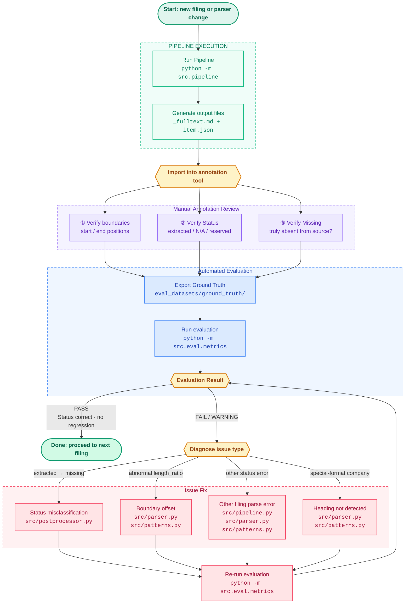

<div align="center">

# SEC 10-K Structured Extraction Tool

Parses SEC EDGAR Form 10-K annual reports into standardized JSON, automatically identifying the content and status of every Item (`extracted` / `incorporated_by_reference` / `not_applicable` / `reserved` / `missing`).

[English](README.md) | [中文](README_zh-CN.md)

</div>

---

## Evaluation Results

> 35 filings, 12 companies, 2016–2026, covering Large / Accelerated / Non-accelerated filer / Smaller reporting company
> Ground truth manually annotated by the author using the self-developed annotation tool [SEC-10-K-Annotation-Tool](https://github.com/LLMSystems/SEC-10-K-Annotation-Tool)

| Metric | Value |
|---|---|
| Status Accuracy | **100.0%** (788 / 788 items) |
| Critical Regressions | **0** |
| Warnings | 5 (all Item 15 / Item 1 boundary issues, see failure mode analysis) |
| Content Length Normal Rate | 99.0% (484 / 489 extracted items) |
| Head/Tail Match Pass Rate | Head 99.8% / Tail 100.0% |
| Average Latency | **0.687s** (download 0.159s + preprocess 0.494s + parse 0.035s) |
| LLM Cost | **$0** |

- Detailed results: [summary file](eval_datasets/results/驗測結果/summary.md)
- Ground truth data: [eval_datasets/ground_truth](eval_datasets/ground_truth)

---

## Project Overview

US public companies are required to file Form 10-K annual reports with the SEC each year. While the structure is governed by SEC regulations (Part I–IV, Items 1–16), real-world formatting varies enormously: inconsistent HTML layouts, diverse heading styles, and Part III frequently fulfilled via incorporated by reference to a Proxy Statement.

This project builds a purely rule-based structured extraction pipeline:

```
Input (CIK + Accession Number or direct URL)
  ↓ fetch: retrieve metadata and HTML from the SEC EDGAR API
  ↓ preprocess: HTML → plain text (handle iXBRL, tables, hyphenation)
  ↓ parse: RegexParser locates the start and end position of each Item
  ↓ postprocess: classify the status of each Item
Output (standardized JSON)
```

---

## Parsing Strategy: Why Rule-Based

### 10-K Filings Have Sufficient Structure

SEC regulations mandate Item numbering and ordering. Heading styles vary (case, punctuation), but they are exhaustively enumerable:

```
Item 1.  /  ITEM 1A:  /  Item 7—  /  ITEM 7A\n
```

What varies is visual formatting; the semantic structure is fixed. This gives a rule-based parser reliable anchors to depend on.

### Cost: $0, Latency: < 1 Second

Processing a full 10-K with an LLM (averaging 100,000–1,000,000 tokens) would cost tens of dollars for even the cheapest model on a 35-filing eval set, plus additional network latency per call.

The rule-based approach spends nearly all its time on EDGAR download (0.159s); parsing itself takes only 0.030s.

### Predictable Failure Modes

When rule-based parsing fails, the cause is explicit (boundary offset, heading not detected) and can be located and fixed directly. LLM failures are difficult to analyze systematically (hallucinations, unstable output format, inconsistency across runs).

### Benchmarks Met

100% Status accuracy and 0 critical regressions across 35 filings — the rule-based approach is accurate enough for this problem domain. Introducing an LLM would add complexity and cost without meaningful gains.

#### Large-Scale Validation Report (507 Filings, 2025-06-08)

Across 507 randomly sampled filings, iterative parser fixes reduced structural errors from **133 to 6** — a **~95.5% reduction**.

While full coverage of every possible filing format cannot be guaranteed, the parser's stable range has improved substantially compared to prior versions.

> **Note**: During optimization, certain special-format filings (e.g., cross-reference type, multi-span paths) were found to have legitimately overlapping section position ranges, where the same page may be referenced by multiple sections. This is not a parse error; the validator has been updated to downgrade the severity for such cases to `info`, which is excluded from error counts.

Full report: [docs/optimize-parser-report.md](docs/optimize-parser-report.md)

##### Data Preparation

| Item | Description |
|---|---|
| Data Source | EDGAR XBRL Viewer (SEC official API) |
| Valid Targets | **507 filings** (companies with an accession_number) |
| Fetch Method | `CachedAsyncPipeline`: downloads HTML from EDGAR on first run, then reads local cache |
| Year Coverage | Latest 10-K filing per company |

##### Validation Rules (Critical Error Level)

| Rule | Trigger Condition |
|---|---|
| Low section coverage | Total readable characters across all sections < 25% of full document |
| Missing core sections | Core sections (Items 1, 1A, 2, 3, 5, 7, 8, 9A, 15) have unexpected final status |
| Field contract violation | Status and content fields are inconsistent (e.g., marked extracted but no content text) |
| Near-empty extracted content | Status is extracted but readable characters < 50 |
| Document too short | Full document readable characters < 30,000 |
| Invalid range | Section start position ≥ end position |

---

## XBRL Financial Data Extraction (Item 8)

In addition to text-based structured extraction, this project also supports reconstructing Item 8 primary financial statements directly from XBRL.

### How It Works

Four XBRL source files are downloaded from SEC EDGAR and parsed:

| Source File | Purpose |
|---|---|
| Instance Document (`.xml`) | All financial figures and contexts (period, currency, dimensions) |
| Presentation Linkbase (`_pre.xml`) | Display order and hierarchy for each financial statement |
| Label Linkbase (`_lab.xml`) | Maps XBRL concept names to human-readable labels |
| Schema (`.xsd`) | Role definitions (identifies income statement, balance sheet, etc.) |

After parsing, results are automatically classified into three blocks:

- **Main Statements**: Income statement, comprehensive income, balance sheet, shareholders' equity, cash flow statement
- **Numeric Disclosures**: Numeric disclosures in notes (may include multi-dimensional breakdowns)
- **Text Disclosures**: Text blocks in notes (including HTML table → Markdown conversion)

### Usage

```python
from src.item8_xbrl_facts import get_item8_xbrl_facts
from src.render_item8_markdown import write_item8_markdown

cik = "0000019617"
accession_number = "0001628280-26-008131"

payload = get_item8_xbrl_facts(cik, accession_number)
write_item8_markdown(payload, f"{cik}_{accession_number}_item8.md")
```

### Output

`write_item8_markdown` generates a Markdown report containing:

- Each financial statement presented with multi-period columns (e.g., FY2025 vs FY2024)
- Automatically formatted numbers (thousands separator, USD/share)
- Multi-dimensional disclosures (e.g., by business segment, by geography) expanded into sub-tables

---

## System Architecture

```
src/
├── models.py               Data structures (FilingInput / FilingOutput / RawItem…)
├── patterns.py             Centralized regex pattern definitions
├── pipeline.py             10-K text extraction main pipeline
├── async_pipeline.py       Async version of the pipeline
├── postprocessor.py        Item status classification
├── item8_xbrl_facts.py     XBRL financial extraction (Instance / Presentation / Label / Schema)
├── render_item8_markdown.py Renders XBRL results as a Markdown report
├── parsers/
│   ├── base.py             Parser interface
│   ├── regex_parser.py     Main parser (rule-based)
│   ├── hybrid.py           Dispatcher (supports future LLM fallback)
│   └── llm_parser.py       LLM parser stub (architecture ready, not yet implemented)
└── eval/
    ├── metrics.py          Evaluation script (compare ground truth, generate report)
    └── runner.py           Batch evaluation entry point for multiple filings
```

**10-K Text Extraction Pipeline Steps:**

- **fetch**: Calls the SEC EDGAR Submissions API to retrieve company metadata, constructs the HTML URL, and downloads it.
- **preprocess**: Parses HTML with BeautifulSoup; strips iXBRL namespace tags (`ix:*`), repairs inline hyphenation (`I\nTEM` → `ITEM`), converts section-heading tables to plain text, and removes page numbers and headers.
- **parse**: RegexParser uses three patterns to locate Item heading positions, deduplicates, then uses each Item's start as the end of the previous Item.
- **postprocess**: Sequentially detects `incorporated_by_reference` (Part III contains reference language), `reserved` (Item 6 by year rule, or content is only "Reserved"), `not_applicable` (content is only N/A), `extracted` (normal); marks `missing` if nothing is found.

**XBRL Financial Extraction Flow:**

- **`item8_xbrl_facts.py`**: Downloads the four XBRL files (Schema / Presentation / Label / Instance), parses role definitions, labels, contexts, and facts, then classifies output by financial statement type.
- **`render_item8_markdown.py`**: Renders extraction results as multi-period financial statement Markdown, including number formatting, multi-dimensional disclosure expansion, and HTML note table conversion.

---

## Evaluation Set Design

### Coverage

| Dimension | Details |
|---|---|
| Companies | 12 |
| Filings | 35 |
| Year Range | 2016–2026 |
| Industries | Technology (AAPL, NFLX, TSLA), Finance (JPM), Restaurant (DENN), Retail (WMT, VRA, RELL), Industrial (HURC, GDC), Cybersecurity (CISO), Telecom Equipment (WSTL) |
| Filer Category | Large accelerated / Accelerated / Non-accelerated / Smaller reporting company |

### Intentionally Selected Edge Cases

| Edge Case | Representative Examples |
|---|---|
| Part III incorporated by reference | AAPL, NFLX, JPM and other large-cap companies |
| Item 6 Reserved (rule changed after 2021) | All filings after 2021 |
| Item 1C Cybersecurity (added after 2023) | AAPL 2023+, TSLA 2023+, etc. |
| Item 4 Mine Safety Not Applicable | All non-mining companies |
| iXBRL format (mandatory for large filers after 2019) | AAPL 2021+, TSLA 2020+ |
| Older HTML formats | WSTL 2016, 2018 |
| Non-standard layouts from small companies | GDC, CISO, WSTL |
| Very large filings (JPM ~400 pages) | JPM 2025 |

### Ground Truth Construction

1. Run the pipeline to produce an initial result, saved as Markdown (with original text for comparison)
2. Import into the self-developed annotation tool [SEC-10-K-Annotation-Tool](https://github.com/LLMSystems/SEC-10-K-Annotation-Tool) to verify start/end boundaries, content correctness, etc.
3. Return to the original EDGAR HTML for any Items in doubt
4. Save corrected annotations as ground truth JSON

---

## Bug Fix Optimization Loop

When the parser encounters issues (new company formats, boundary errors, incorrect status classification), use the following workflow for rapid fix-and-verify cycles. Combined with the self-developed annotation tool [SEC-10-K-Annotation-Tool](https://github.com/LLMSystems/SEC-10-K-Annotation-Tool), this enables a continuous improvement loop.


---

## Quick Start

### Installation

```bash
python -m venv .venv
source .venv/bin/activate
pip install -r requirements.txt
```

### Usage

#### Synchronous

```python
from src.pipeline import Pipeline
from src.models import FilingInput

pipeline = Pipeline()

# Option 1: CIK + Accession Number
result = pipeline.run(FilingInput(
    cik="0000320193",
    accession_number="0000320193-23-000106",
))

# Option 2: Direct URL
result = pipeline.run(FilingInput(
    url="https://www.sec.gov/Archives/edgar/data/.../filing.htm",
))

# Save results (JSON + Markdown)
result = pipeline.run(input, save_to="output/")
```

#### Async

```python
from src.async_pipeline import AsyncPipeline
from src.models import FilingInput
import asyncio

async def main():
    pipeline = AsyncPipeline()

    # Option 1: CIK + Accession Number
    result = await pipeline.run_async(FilingInput(
        cik="0000320193",
        accession_number="0000320193-23-000106",
    ))

    # Option 2: Direct URL
    result = await pipeline.run_async(FilingInput(
        url="https://www.sec.gov/Archives/edgar/data/.../filing.htm",
    ))

if __name__ == "__main__":
    asyncio.run(main())
```

### Output Format

```json
{
  "filing_info": {
    "cik": "0000320193",
    "accession_number": "0000320193-23-000106",
    "company_name": "Apple Inc.",
    "fiscal_year_end": "2023-09-30"
  },
  "items": [
    {
      "part": "Part I",
      "item_number": "1",
      "item_title": "Business",
      "content_text": "Apple Inc. designs, manufactures...",
      "char_range": [1024, 45231],
      "status": "extracted"
    },
    {
      "part": "Part III",
      "item_number": "10",
      "item_title": "Directors, Executive Officers and Corporate Governance",
      "content_text": null,
      "char_range": null,
      "status": "incorporated_by_reference"
    }
  ]
}
```

### Running Evaluation Against the Annotated Dataset

```bash
python -m src.eval.metrics \
    --ground-truth eval_datasets/ground_truth \
    --output eval_datasets/results
```

Each run creates a timestamped subdirectory under `eval_datasets/results/`:

```
eval_datasets/results/
└── 2026-05-11_23-46-54/
    ├── summary.md          # Overall evaluation report (human-readable)
    ├── summary.json        # Overall evaluation report (machine-readable)
    └── per_filing/
        ├── AAPL_2023.json  # Item-by-item comparison for a single filing
        ├── TSLA_2021.json
        └── ...
```

**`summary.md` includes:**

- **Overall metrics**: Status accuracy, critical regression count, warning count, average latency
- **Status confusion matrix**: 5×5 cross-comparison of GT vs Pred, verifying no cross-status misclassification
- **Length ratio statistics**: Distribution of pred content length / GT length (P10, median, P90), detecting boundary truncation or overrun
- **Head/tail match pass rate**: Whether the first and last 150 characters of GT appear in pred, verifying start/end boundary precision
- **Per-item error rate ranking**: Which Items are most error-prone
- **Per-filing overview**: Accuracy and grade per filing (PASS / WARNING / FAIL)
- **Issue details**: Non-PASS filings listed Item-by-Item with severity and reason

---

## Known Limitations

- **Minimum supported year**: HTML-format filings from approximately 2000 onward. SGML / plain-text formats from before 1996 have no HTML structure and cannot be correctly processed by the preprocessor.
