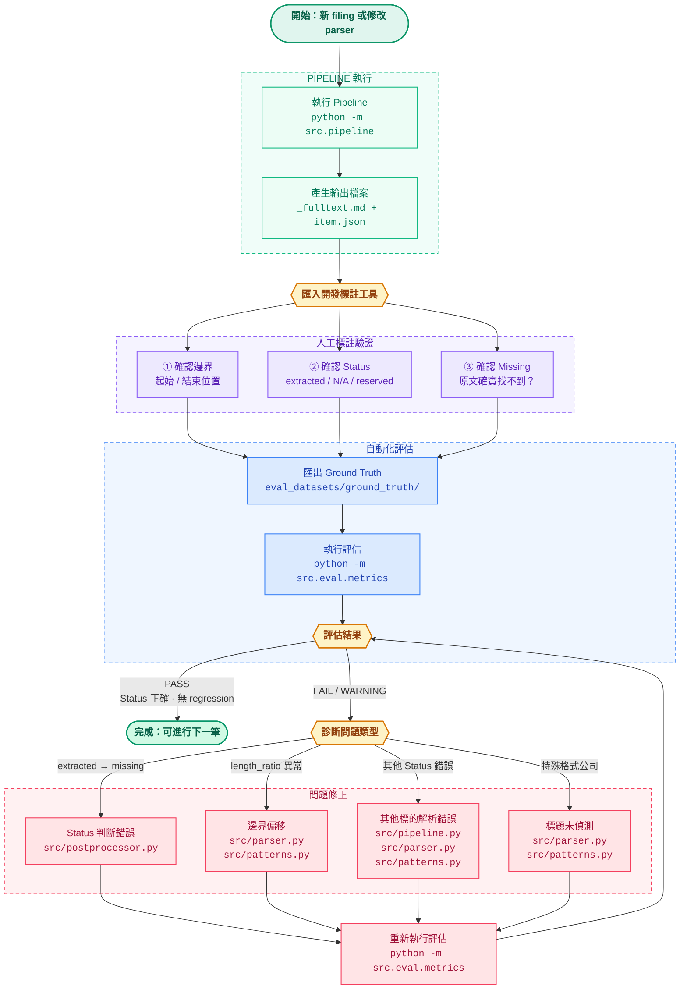

<div align="center">

# SEC 10-K 財報結構化抽取工具

將 SEC EDGAR 上的 Form 10-K 年報解析成標準化 JSON，自動識別所有 Item 的內容與狀態（`extracted` / `incorporated_by_reference` / `not_applicable` / `reserved` / `missing`）。

</div>

---

## 評測結果

> 35 筆申報、12 家公司、2016–2026 年、涵蓋 Large / Accelerated / Non-accelerated filer / Smaller reporting company
> Ground truth 由本人人工標註，使用自行開發的標註工具 [SEC-10-K-Annotation-Tool](https://github.com/LLMSystems/SEC-10-K-Annotation-Tool)

| 指標 | 數值 |
|---|---|
| Status 準確率 | **100.0%**（788 / 788 items） |
| Critical Regressions | **0** |
| Warning 數 | 5（全為 Item 15 / Item 1 邊界問題，見失敗模式分析） |
| 內容長度正常比例 | 99.0%（484 / 489 extracted items） |
| 頭尾比對通過率 | 頭部 99.8% / 尾部 100.0% |
| 平均耗時 | **0.687 秒**（下載 0.159s + 預處理 0.494s + 解析 0.035s） |
| LLM 費用 | **$0** |

- 上述詳細結果可參考以下[彙整檔案](eval_datasets/results/驗測結果/summary.md)
- 標註資料(ground truth)檔案詳見 [標註資料](eval_datasets/ground_truth)

---

## 專案概覽

美國上市公司每年須向 SEC 提交 Form 10-K 年報，其結構雖由 SEC 規範（Part I–IV，Item 1–16），但現實中格式差異極大：HTML 排版不一致、標題寫法多元、Part III 常以 incorporated by reference 指向 Proxy Statement。

本專案建立一條純規則式的結構化抽取 Pipeline：

```
輸入（CIK + Accession Number 或直接 URL）
  ↓ fetch：從 SEC EDGAR API 取得 metadata 與 HTML
  ↓ preprocess：HTML → 純文字（處理 iXBRL、table、斷字）
  ↓ parse：RegexParser 找到各 Item 的起終位置
  ↓ postprocess：分類每個 Item 的 status
輸出（標準化 JSON）
```

---

## 解析策略：為什麼選擇規則式

### 10-K 格式具備足夠的結構性

SEC 規範強制要求 Item 編號與順序，標題寫法雖有變異（大小寫、分隔符），但可窮舉：

```
Item 1.  /  ITEM 1A:  /  Item 7—  /  ITEM 7A\n
```

格式變的是排版與視覺樣式，語意結構是固定的。這讓規則式 parser 有明確的錨點可以依賴。

### 成本：$0，延遲：< 1 秒

若用 LLM 處理整份 10-K（平均 100,000–1000,000 tokens），即使用最便宜的模型，35 筆 eval set 也需數十美元，且每次呼叫需要額外的網路延遲。

規則式的耗時幾乎全來自 EDGAR 下載（0.159 秒），解析本身只需 0.030 秒。

### 可預測的失敗模式

規則式出錯時原因明確（邊界偏移、標題未被偵測到），可直接定位並修復。LLM 出錯時難以系統性分析（幻覺、格式不穩定、每次輸出不一致）。

### 實測結果已達標

35 筆申報 Status 準確率 100%、0 critical regression，規則式在這個問題域的準確度已足夠，引入 LLM 只會增加複雜度與成本，而不會帶來顯著收益。

---

## XBRL 財報擷取（Item 8）

除了文字結構化抽取，本專案另提供從 XBRL 直接還原 Item 8 主要財務報表的功能。

### 運作方式

從 SEC EDGAR 下載四份 XBRL 原始檔案並解析：

| 來源檔案 | 用途 |
|---|---|
| Instance Document (`.xml`) | 所有財務數字與 context（期間、幣別、維度） |
| Presentation Linkbase (`_pre.xml`) | 各財務報表的展示順序與層級 |
| Label Linkbase (`_lab.xml`) | 將 XBRL concept 名稱轉換為人類可讀標籤 |
| Schema (`.xsd`) | Role 定義（收益表、資產負債表等的識別） |

解析後自動分類為三個區塊：

- **Main Statements**：損益表、綜合損益表、資產負債表、股東權益表、現金流量表
- **Numeric Disclosures**：附註中的數字揭露（可含多維度拆分）
- **Text Disclosures**：附註中的文字 block（含 HTML 表格轉 Markdown）

### 使用方式

```python
from src.item8_xbrl_facts import get_item8_xbrl_facts
from src.render_item8_markdown import write_item8_markdown

cik = "0000019617"
accession_number = "0001628280-26-008131"

payload = get_item8_xbrl_facts(cik, accession_number)
write_item8_markdown(payload, f"{cik}_{accession_number}_item8.md")
```

### 輸出

`write_item8_markdown` 產生一份 Markdown 報告，包含：
- 各財務報表以多期間欄位呈現（例如 FY2025 vs FY2024）
- 數字自動格式化（千分位、USD/share）
- 多維度揭露（如分業務線、分地區）展開為子表格

---

## 系統架構

```
src/
├── models.py               資料結構（FilingInput / FilingOutput / RawItem…）
├── patterns.py             全部 Regex Pattern 集中定義
├── pipeline.py             10-K 文字抽取主流程
├── async_pipeline.py       非同步版本 Pipeline
├── postprocessor.py        Item status 分類
├── item8_xbrl_facts.py     XBRL 財報擷取（Instance / Presentation / Label / Schema）
├── render_item8_markdown.py XBRL 結果渲染為 Markdown 報告
├── parsers/
│   ├── base.py             Parser 介面
│   ├── regex_parser.py     主 Parser（規則式）
│   ├── hybrid.py           調度器（支援未來接入 LLM fallback）
│   └── llm_parser.py       LLM Parser stub（架構已備，尚未實作）
└── eval/
    ├── metrics.py          評測程式（比對 ground truth、產生報告）
    └── runner.py           批次執行多筆 filing 的評測入口
```

**10-K 文字抽取 Pipeline 各步驟：**

- **fetch**：呼叫 SEC EDGAR Submissions API 取得公司 metadata，組出 HTML URL 後下載。
- **preprocess**：用 BeautifulSoup 解析 HTML；拆除 iXBRL 命名空間 tag（`ix:*`）、修復 inline 斷字（`I\nTEM` → `ITEM`）、將章節標題型 table 轉純文字、清除頁碼與頁眉。
- **parse**：RegexParser 用三種 pattern 找 Item 標題位置，去重後以相鄰 Item 的起點作為前一個 Item 的終點。
- **postprocess**：依序偵測 `incorporated_by_reference`（Part III 含引用字樣）、`reserved`（Item 6 依年份規則、或內容只有「Reserved」）、`not_applicable`（內容只有 N/A）、`extracted`（正常），找不到則標記 `missing`。

**XBRL 財報擷取流程：**

- **`item8_xbrl_facts.py`**：下載 Schema / Presentation / Label / Instance 四份 XBRL 檔案，解析 role 定義、labels、contexts、facts，按財務報表類型分類輸出。
- **`render_item8_markdown.py`**：將擷取結果渲染為多期間財務報表 Markdown，包含數字格式化、多維度揭露展開、HTML 附註表格轉換。

---

## Evaluation Set 設計

### 涵蓋範圍

| 維度 | 內容 |
|---|---|
| 公司數 | 12 家 |
| 申報數 | 35 筆 |
| 年份跨度 | 2016–2026 |
| 產業 | 科技（AAPL、NFLX、TSLA）、金融（JPM）、餐飲（DENN）、零售（WMT、VRA、RELL）、工業（HURC、GDC）、資安（CISO）、電信設備（WSTL） |
| Filer Category | Large accelerated / Accelerated / Non-accelerated / Smaller reporting company |

### 刻意挑選的 Edge Case

| Edge Case | 代表案例 |
|---|---|
| Part III incorporated by reference | AAPL、NFLX、JPM 等大型公司 |
| Item 6 Reserved（2021 後規則改變） | 2021 年後所有申報 |
| Item 1C Cybersecurity（2023 後新增） | AAPL 2023+、TSLA 2023+ 等 |
| Item 4 Mine Safety Not Applicable | 非採礦業各公司 |
| iXBRL 格式（2019 後大型公司強制） | AAPL 2021+、TSLA 2020+ |
| 較舊的 HTML 格式 | WSTL 2016、2018 |
| 小公司非標準排版 | GDC、CISO、WSTL |
| 超大型申報（JPM 年報約 400 頁） | JPM 2025 |

### Ground Truth 建立方式

1. 用 Pipeline 產出初版結果，存成 Markdown（含原文對照）
2. 匯入自行開發標註工具 [SEC-10-K-Annotation-Tool](https://github.com/LLMSystems/SEC-10-K-Annotation-Tool) 核對起始邊界，內容正確性、結束邊界是否正確等
3. 對有疑問的 Item 回到 EDGAR 原始 HTML 確認
4. 修正後存成 ground truth JSON

---

## 發現錯誤優化循環
當 parser 出現問題（新公司格式、邊界錯誤、status 判斷失誤）時，透過以下流程快速修正並驗證，結合自行開發標註工具 [SEC-10-K-Annotation-Tool](https://github.com/LLMSystems/SEC-10-K-Annotation-Tool) 可快速建立優化循環，持續提升解析準確度


---

## 快速開始

### 安裝

```bash
python -m venv .venv
source .venv/bin/activate
pip install -r requirements.txt
```

### 使用方式
**同步**
```python
from src.pipeline import Pipeline
from src.models import FilingInput

pipeline = Pipeline()

# 方式一：CIK + Accession Number
result = pipeline.run(FilingInput(
    cik="0000320193",
    accession_number="0000320193-23-000106",
))

# 方式二：直接給 URL
result = pipeline.run(FilingInput(
    url="https://www.sec.gov/Archives/edgar/data/.../filing.htm",
))

# 儲存結果（JSON + Markdown）
result = pipeline.run(input, save_to="output/")
```

**異步**
```python
from src.async_pipeline import AsyncPipeline
from src.models import FilingInput
import asyncio

async def main():
    pipeline = AsyncPipeline()

    # 方式一：CIK + Accession Number
    result = await pipeline.run_async(FilingInput(
        cik="0000320193",
        accession_number="0000320193-23-000106",
    ))

    # 方式二：直接給 URL
    result = await pipeline.run_async(FilingInput(
        url="https://www.sec.gov/Archives/edgar/data/.../filing.htm",
    ))

if __name__ == "__main__":
    asyncio.run(main())
```

### 輸出格式

```json
{
  "filing_info": {
    "cik": "0000320193",
    "accession_number": "0000320193-23-000106",
    "company_name": "Apple Inc.",
    "fiscal_year_end": "2023-09-30"
  },
  "items": [
    {
      "part": "Part I",
      "item_number": "1",
      "item_title": "Business",
      "content_text": "Apple Inc. designs, manufactures...",
      "char_range": [1024, 45231],
      "status": "extracted"
    },
    {
      "part": "Part III",
      "item_number": "10",
      "item_title": "Directors, Executive Officers and Corporate Governance",
      "content_text": null,
      "char_range": null,
      "status": "incorporated_by_reference"
    }
  ]
}
```

### 使用人工標註資料集進行評測

```bash
python -m src.eval.metrics \
    --ground-truth eval_datasets/ground_truth \
    --output eval_datasets/results
```

每次執行會在 `eval_datasets/results/` 下建立時間戳子目錄，結構如下：

```
eval_datasets/results/
└── 2026-05-11_23-46-54/
    ├── summary.md          # 整體評估報告（人類可讀）
    ├── summary.json        # 整體評估報告（機器可讀）
    └── per_filing/
        ├── AAPL_2023.json  # 單筆 filing 的逐 Item 比對結果
        ├── TSLA_2021.json
        └── ...
```

**`summary.md` 包含以下項目：**

- **整體指標**：Status 準確率、Critical Regressions 數、Warning 數、平均耗時
- **Status 混淆矩陣**：GT vs Pred 的 5×5 交叉比對，確認各 status 是否互相錯判
- **Length Ratio 統計**：pred 內容長度 / GT 長度的分佈（P10、中位數、P90），偵測邊界截短或越界
- **頭尾比對通過率**：GT 頭尾各 150 字是否出現在 pred 中，驗證起終邊界的精確度
- **各 Item 錯誤率排行**：哪些 Item 最容易出錯
- **各 Filing 概覽**：每筆申報的準確率與等級（PASS / WARNING / FAIL）
- **問題明細**：非 PASS 的 filing 逐 Item 列出嚴重程度與原因

---

## 已知限制

- **適用年份下限**：約 2000 年後的 HTML 格式申報。1996 年前的 SGML / 純文字格式無 HTML 結構，preprocessing 無法正確處理。