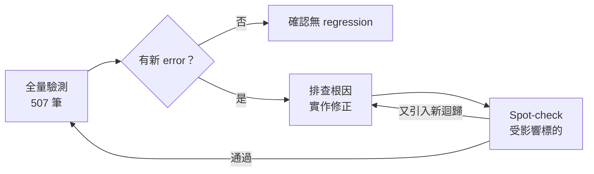

# SEC 10-K 結構化抽取 — 驗測報告

> 資料快照：2026-06-09  
> 結果檔：`validation_results_500.json`（共 507 筆）

---

## 目標

本次優化解析器的目標並非追求 100% 正確率，而是以結構性錯誤為基準，系統性地識別明顯有問題的申報結果，並透過持續的修正迴圈逐步提升整體品質。


## 結論

在隨機挑選的 507 檔申報的驗測上，解析器經過數輪修正迭代，結構錯誤率大幅下降從 **133 筆降至 6 筆**，錯誤率減少約 **95.5%**。  

雖然目前仍無法保證能完整涵蓋所有申報格式，但相較於先前版本，解析器可穩定處理的申報範圍已大幅提升。

結果資料來源：
- `validation_results_507_unoptimized.json`（優化前）
- `validation_results_507_optimized.json`（優化後）

---

## 一、資料準備

| 項目 | 說明 |
|---|---|
| 資料來源 | EDGAR EDGAR XBRL Viewer（SEC 官方 API） |
| 樣本檔案 | `company_tickers_sample500.json` |
| 有效標的 | **507 筆**（含 accession_number 的公司） |
| 抓取方式 | `CachedAsyncPipeline`：首次從 EDGAR 下載 HTML，之後讀本地快取，避免重複打 API |
| 涵蓋年份 | 以各公司最新一份 10-K 為準 |
| 公司類型 | 隨機抽取 507 檔 |

---

## 二、修正 → 驗測迴圈示意圖



## 三、評分與嚴重度機制

每份申報跑完後，`Validator` 針對 **raw_items**（parser 幾何輸出）與 **final items**（status 分類）執行以下規則，輸出 `QualityReport`：


### 驗證規則（嚴重缺失錯誤等級）

| 規則 | 觸發條件 |
|---|---|
| 章節覆蓋率過低 | 所有章節可讀字數加總不足全文的 25% |
| 核心章節缺失 | 核心章節（第 1、1A、2、3、5、7、8、9A、15 條）最終狀態不符預期 |
| 欄位契約矛盾 | 狀態與內容欄位不一致（如標記為已抽取卻無內容文字） |
| 抽取內容近乎空 | 狀態標記為已抽取，但可讀字元不足 50 字 |
| 文件過短 | 全文可讀字元低於 30,000 字 |
| 範圍不合法 | 章節起始位置 ≥ 結束位置 |

---

## 四、複現步驟

### 環境需求

```bash
pip install -r requirements.txt   # beautifulsoup4, lxml, pydantic, httpx …
```

> 需要能連外網存取 EDGAR API（`data.sec.gov`）。第一次跑會下載並快取到 `cache/` 目錄，之後重跑不打 API。

### 執行全量驗測

```bash
python run_companys_advance.py
```

輸出 `validation_results_500.json`，同時在 console 印出逐筆結果與最終統計。

### 複現單筆標的（快速 spot-check）

```python
import asyncio, json
from pathlib import Path
from src.async_pipeline import AsyncPipeline
from src.pipeline import FilingInput

# 以 OMCC 為例
async def main():
    pipeline = AsyncPipeline()
    out = await pipeline.run_async(FilingInput(
        cik='0001000045',
        accession_number='0000950170-25-091151'
    ))
    q = out.quality
    print(f"score={q.score}  found={q.found_item_count}/{q.expected_item_count}")
    print(f"flags: {[(f.code, f.severity) for f in q.flags]}")

asyncio.run(main())
```
