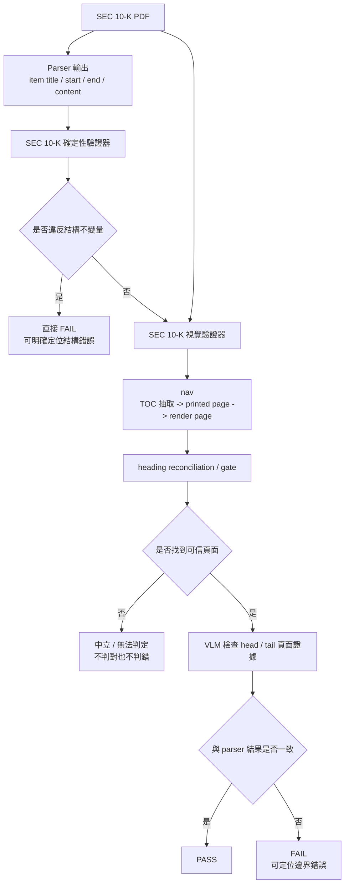

# SEC 10-K Parser 驗證總報告

> 舊版總報告已保留於 [combined_validation_report_legacy.md](./combined_validation_report_legacy.md)。
> 本版重新整合 [SEC 10-K 視覺驗證器報告（Nav + E2E）](./external_reference_validation/sec10k_visual_validator_report.md) 與 [SEC 10-K 確定性驗證器報告](./deterministic_validation/deterministic_validation_report.md)。

## 結論先行

本報告提出一套完整的 SEC 10-K parser 驗證架構，由兩個互補模組組成：

1. **SEC 10-K 視覺驗證器**
   先用 VLM 自動完成頁面導航，再以頁面證據檢查 parser 抽出的 item 前後邊界是否正確。
2. **SEC 10-K 確定性驗證器**
   驗證任何正確解析都必然滿足的結構條件。這些條件一旦被違反，就能直接判定 parser 結果存在錯誤。

這兩套方法合起來形成一條完整的驗證閉環：

- 視覺驗證器負責回答「即使結構上沒有明顯矛盾，頁面上的 item 起點與終點是否真的和 parser 輸出一致」。
- 確定性驗證器負責回答「這份 parser 結果是否違反必然成立的結構不變量」。

目前的核心實驗結論如下：

- **視覺驗證器**
  - `nav` 階段在 5 份 filing、62 個 item 上達到 `56/62 (90.3%)` exact、`60/62 (96.8%)` within `±1 page`。
    這表示視覺驗證器已能在大多數 item 上先自動找到正確頁面，並把少數偏差控制在很小的頁碼範圍內。
  - `e2e precision` 基線在 gated 子集上達到 `head 59/60 (98.3%)`、`tail 38/44 (86.4%)`。
    這表示在成功導航到可信頁面的前提下，視覺驗證器對正確 parser 結果具有很低的誤殺率，尤其 head 驗證已相當穩定。
  - `e2e detection` 基線在 4 類錯誤上的偵測率落在 `83.1%–94.7%`。
    這表示視覺驗證器不只會在 clean case 上通過，也能對常見的截斷與越界錯誤提供穩定的偵測能力。
  - 以本次精度最佳模型 `google/gemini-3-flash-preview` 估算，完整跑完一份 filing 的成本約為 `US$0.022`，折合約 `NT$0.7`，亦即不到 `NT$1`／份。
    這表示即使使用目前表現最好的模型，這套視覺驗證流程的單份驗證成本仍相當低。
- **確定性驗證器**
  - 在 34 份人工標註的 10-K Ground Truth 上，4 條規則的 false positive 均為 `0/34 (0.0%)`。
    這表示確定性驗證器在真實正確資料上沒有誤殺，規則本身足夠保守且與資料分布無關。
  - 在 3,760 個系統性注入錯誤樣本上，規則 1、2、4 的偵測率為 `100%`；規則 3 對核心 item 遺失與大段內文遺失的偵測率亦為 `100%`。
    這表示確定性驗證器已能穩定抓出違反必要結構條件的 parser 錯誤，特別適合處理區間非法、順序錯亂、重要 item 消失與全文異常過短等問題。

綜合而言，這套驗證架構已能同時提供：

- 對結構錯誤的**確定性證偽能力**
- 對頁面邊界錯誤的**高信心視覺複查能力**
- 對 parser 結果的**可重現、可量化**驗證流程

---

## 1. 驗證總體設計

### 1.1 為什麼需要兩套驗證器

SEC 10-K 解析錯誤大致可分成兩類：

- **結構型錯誤**
  例如頁面區間非法、item 順序倒退、區間重疊、重要 item 消失、全文內容異常過短。這類錯誤不需要理解頁面語意，只要違反必要條件，就可直接判錯。
- **邊界型錯誤**
  例如 item 開頭抓錯、尾段被截斷、尾端越界讀到下一節、頁面導航偏移。這類錯誤即使整體 JSON 看起來「格式正常」，仍可能需要回到 PDF 頁面做實際驗證。

因此，本報告將 parser 驗證拆成兩層：

1. **視覺驗證器**
   用來處理「需要頁面證據」的邊界檢查。
2. **確定性驗證器**
   用來處理「違反即證錯」的必要條件。

### 1.2 閉環流程



這個設計的重點不是把兩種方法疊加成更複雜的流程，而是讓它們各自處理最擅長的錯誤型態：

- 確定性驗證器優先擋掉成本最低、證據最明確的結構錯誤。
- 視覺驗證器只在需要頁面證據時介入，補上 parser JSON 本身看不到的問題。

---

## 2. SEC 10-K 視覺驗證器

### 2.1 目標與定位

SEC 10-K 視覺驗證器的目標，是建立一條獨立於 parser 內容的頁面驗證鏈，回答以下問題：

- 這個 item 應該落在哪一頁？
- parser 抽出的開頭，是否真的出現在該 item 的開頭頁？
- parser 抽出的尾端，是否真的停在該 item 的結尾頁，而沒有被截斷或越界？

它不是單純的 OCR 測試，也不是只測「VLM 能不能看懂頁面」。它真正要驗證的是：**當 parser 輸出進來後，是否能用視覺證據對 item 邊界做高信心複查。**

### 2.2 方法拆解

視覺驗證器分成兩個階段：

1. **Navigation (`nav`)**
   用 VLM 從 TOC 抽取 `item -> printed page`，再將 printed page 對齊到 PDF render page，最後以 `Item N + title` 在正文頁做 heading reconciliation。
2. **End-to-End Validation (`e2e`)**
   在 `nav` 導出的可信頁面上，讓 VLM 檢查 parser 結果的 head / tail 是否與頁面證據一致。

如果 `nav` 無法找到可信頁面，系統會輸出：

- **中立 / 無法判定**

這一點很重要，因為 gate 失敗代表證據不足，不代表 parser 一定錯。

### 2.3 驗證資料

視覺驗證器目前使用 5 份人工整理(新增pdf頁碼對應資訊)的 benchmark filing：

- `GDC_2023`
- `NFLX_2025`
- `RELL_2025`
- `TSLA_2023`
- `WMT_2026`

每份資料都包含：

- 原始 `PDF`
- 由 PDF 渲染出的頁面 `PNG`
- item 內容 Ground Truth，例如 `content.json`
- item 頁碼與邊界標註，例如 `pages.json`

這組 benchmark 的設計目的，不是量大規模覆蓋，而是讓 `nav`、`e2e precision`、`e2e detection` 都能在同一批可追查資料上完成評估。

幾個關鍵分母需要一併說清楚：

- `nav` 的總分母是 `62`，代表 5 份 filing 中納入導航評估的 item 數。
- `e2e precision` 先看 `gate`，因此會先從 `62` 收斂到成功找到可信頁面的子集；在基線中為 `60/62`。
- `head precision` 只在 gated clean item 上計算，因此基線分母為 `60`。
- `tail precision` 進一步只在可評估 tail 子集上計算，因此基線分母為 `44`。
- `e2e detection` 的分母來自 `gate + clean-pass` 子集，所以不同 detect model 之間可能略有不同。

因此，視覺驗證器的所有數字都應解讀為：

- 先有獨立導航
- 再有 gate
- 最後才在可判定子集上做 head / tail 驗證與錯誤注入測試

### 2.4 模型選型

本節的模型選型不是任意羅列，而是先參考 [bench.md](./external_reference_validation/bench.md) 中整理的多模態模型 survey。該表彙整了多個主流 VLM 的公開 benchmark 排名，以及價格、context window、速度與首 token 延遲等資訊，作為本研究建立候選池的起點。

在此基礎上，本報告再依下列條件縮小到實際評估模型：

- 可透過目前實驗環境穩定呼叫
- 支援本研究需要的影像輸入
- 成本、速度與可重跑性適合進行 5 份 filing 的完整比較
- 不使用 free-tier 結果作為正式對照主表

因此，這裡的 `nav` 與 `detect` 模型集合，應理解為「根據 `bench.md` 建立候選池後，實際納入本研究驗證的子集」。

#### Navigation model

`nav` 階段固定採用：

- `google/gemini-3-flash-preview`

原因不是單一指標最佳而已，而是 navigation task 本身較難，包含：

- TOC 頁辨識
- `item -> printed page` 抽取
- `printed page -> render page` 對位
- heading reconciliation
- TOC 與正文同名 item 的排除

在這種多步驟導航任務中，穩定性與覆蓋率比單一 head/tail 分數更重要，因此 `nav` 直接固定使用目前最穩定的模型。

#### Detection models

`detect` 階段則評估 13 個開源/閉源模型：

- `google/gemini-3-flash-preview`
- `google/gemini-3.1-flash-lite`
- `google/gemini-2.5-pro`
- `google/gemini-2.5-flash`
- `google/gemma-4-31b-it`
- `google/gemma-4-26b-a4b-it`
- `qwen/qwen3.6-plus`
- `qwen/qwen3.6-27b`
- `qwen/qwen3.5-27b`
- `qwen/qwen3.5-122b-a10b`
- `qwen/qwen3.5-35b-a3b`
- `qwen/qwen3.5-9b`
- `moonshotai/kimi-k2.6`

評估分成兩個子任務：

- `e2e.run`：量 clean precision / false positive
- `e2e.inject`：量 detection / recall

### 2.5 Stage 1：Navigation 覆蓋率

`nav` 在 5 份 filing、62 個 item 上的結果如下：

| filing | exact | within `±1 page` |
|---|---:|---:|
| `GDC_2023` | `15/16 (93.8%)` | `16/16 (100.0%)` |
| `NFLX_2025` | `9/11 (81.8%)` | `11/11 (100.0%)` |
| `RELL_2025` | `9/11 (81.8%)` | `10/11 (90.9%)` |
| `TSLA_2023` | `11/12 (91.7%)` | `11/12 (91.7%)` |
| `WMT_2026` | `12/12 (100.0%)` | `12/12 (100.0%)` |
| **合計** | **`56/62 (90.3%)`** | **`60/62 (96.8%)`** |

這代表：

- `nav` 已能為大多數 item 找到正確頁面。
- 即使未完全 exact，絕大多數誤差也落在 `±1 page` 內，足以作為 heading reconciliation 的起點。

### 2.6 Stage 2：E2E Precision 基線

基線設定：

- `nav-model = google/gemini-3-flash-preview`
- `detect-model = google/gemini-3-flash-preview`

| filing | gate | head precision | tail precision |
|---|---:|---:|---:|
| `GDC_2023` | `16/16 (100.0%)` | `16/16 (100.0%)` | `9/10 (90.0%)` |
| `NFLX_2025` | `11/11 (100.0%)` | `11/11 (100.0%)` | `9/10 (90.0%)` |
| `RELL_2025` | `10/11 (90.9%)` | `9/10 (90.0%)` | `5/6 (83.3%)` |
| `TSLA_2023` | `11/12 (91.7%)` | `11/11 (100.0%)` | `8/10 (80.0%)` |
| `WMT_2026` | `12/12 (100.0%)` | `12/12 (100.0%)` | `7/8 (87.5%)` |
| **合計** | **`60/62 (96.8%)`** | **`59/60 (98.3%)`** | **`38/44 (86.4%)`** |

解讀如下：

- `gate 60/62` 代表只有極少數 item 因證據不足而保持中立。
- `head 59/60` 顯示在可信頁面上，head 驗證已非常穩定。
- `tail 38/44` 仍明顯較 head 困難，反映 tail 對跨頁短尾巴、同頁換節、尾段視覺不對稱等情境更敏感。

### 2.7 Stage 2：13 模型 Precision Sweep

以下表格固定 `nav-model = google/gemini-3-flash-preview`，比較 13 個 `detect-model` 的 `e2e.run` 結果。分母統一以 gated clean 子集計算：

- head 分母：`60`
- tail 分母：`44`

| rank | detect model | head | tail |
|---|---|---:|---:|
| 1 | `google/gemini-3-flash-preview` | `59/60 (98.3%)` | `38/44 (86.4%)` |
| 2 | `google/gemini-3.1-flash-lite` | `60/60 (100.0%)` | `36/44 (81.8%)` |
| 2 | `google/gemini-2.5-pro` | `58/60 (96.7%)` | `36/44 (81.8%)` |
| 4 | `moonshotai/kimi-k2.6` | `57/60 (95.0%)` | `35/44 (79.5%)` |
| 5 | `qwen/qwen3.6-plus` | `60/60 (100.0%)` | `34/44 (77.3%)` |
| 5 | `google/gemini-2.5-flash` | `58/60 (96.7%)` | `34/44 (77.3%)` |
| 7 | `qwen/qwen3.6-27b` | `60/60 (100.0%)` | `33/44 (75.0%)` |
| 7 | `qwen/qwen3.5-27b` | `60/60 (100.0%)` | `33/44 (75.0%)` |
| 9 | `qwen/qwen3.5-35b-a3b` | `59/60 (98.3%)` | `32/44 (72.7%)` |
| 9 | `qwen/qwen3.5-9b` | `60/60 (100.0%)` | `32/44 (72.7%)` |
| 11 | `google/gemma-4-31b-it` | `56/60 (93.3%)` | `31/44 (70.5%)` |
| 12 | `qwen/qwen3.5-122b-a10b` | `60/60 (100.0%)` | `30/44 (68.2%)` |
| 13 | `google/gemma-4-26b-a4b-it` | `49/60 (81.7%)` | `20/44 (45.5%)` |

這張表的重點不只是排序，而是說明在相同 `nav` 前提下，不同 VLM 在 clean 邊界驗證上的穩定度差異。

- `google/gemini-3-flash-preview` 在 head 與 tail 兩端維持最均衡的結果，因此被用作主要基線。
- `google/gemini-3.1-flash-lite` 與 `google/gemini-2.5-pro` 的 tail precision 接近第一梯隊，顯示 Gemini 系列在這個任務上整體較穩。
- 多個 Qwen 模型在 head precision 幾乎滿分，但 tail precision 普遍低於 Gemini，表示它們較容易在尾端邊界上出現提早停下或越界讀取。
- `google/gemma-4-26b-a4b-it` 與部分較小模型的 tail 明顯偏低，說明在同樣的頁面導航前提下，邊界判讀能力仍有明顯落差。

### 2.8 Stage 3：E2E Detection 基線

基線模型 `google/gemini-3-flash-preview` 的 `e2e.inject` 結果如下：

| operator | `50 lines` | `50%` |
|---|---:|---:|
| `truncate_head` | `53/59 (89.8%)` | `49/59 (83.1%)` |
| `overrun_head` | `55/59 (93.2%)` | `55/59 (93.2%)` |
| `truncate_tail` | `33/38 (86.8%)` | `36/38 (94.7%)` |
| `overrun_tail` | `36/38 (94.7%)` | `33/38 (86.8%)` |

這表示：

- 對 head 類錯誤，視覺驗證器可穩定抓到大多數截斷與越界。
- 對 tail 類錯誤，偵測率仍維持在 `86.8%–94.7%`。
- 這些數字是在完整 `nav + gate + detect` 流程下取得，而不是直接吃人工指定頁碼。

### 2.9 Stage 3：13 模型 Detection Sweep

以下表格固定 `nav-model = google/gemini-3-flash-preview`，比較 13 個 `detect-model` 的 `e2e.inject` 結果。

注意：這張表的分母來自各模型自己的 `gate + clean-pass` 子集，因此模型間分母可能略有不同；這是 e2e 設計的一部分，不是統計錯誤。

| detect model | `truncate_head` | `overrun_head` | `truncate_tail` | `overrun_tail` |
|---|---|---|---|---|
| `google/gemini-3-flash-preview` | `53/59 (89.8%)` / `49/59 (83.1%)` | `55/59 (93.2%)` / `55/59 (93.2%)` | `33/38 (86.8%)` / `36/38 (94.7%)` | `36/38 (94.7%)` / `33/38 (86.8%)` |
| `google/gemini-3.1-flash-lite` | `54/60 (90.0%)` / `50/60 (83.3%)` | `56/60 (93.3%)` / `56/60 (93.3%)` | `31/36 (86.1%)` / `35/36 (97.2%)` | `34/36 (94.4%)` / `32/36 (88.9%)` |
| `google/gemini-2.5-pro` | `52/58 (89.7%)` / `48/58 (82.8%)` | `54/58 (93.1%)` / `54/58 (93.1%)` | `29/36 (80.6%)` / `34/36 (94.4%)` | `35/36 (97.2%)` / `30/36 (83.3%)` |
| `google/gemini-2.5-flash` | `51/58 (87.9%)` / `48/58 (82.8%)` | `54/58 (93.1%)` / `54/58 (93.1%)` | `29/34 (85.3%)` / `33/34 (97.1%)` | `32/34 (94.1%)` / `27/34 (79.4%)` |
| `google/gemma-4-31b-it` | `50/56 (89.3%)` / `46/56 (82.1%)` | `53/56 (94.6%)` / `53/56 (94.6%)` | `28/31 (90.3%)` / `30/31 (96.8%)` | `29/31 (93.5%)` / `27/31 (87.1%)` |
| `google/gemma-4-26b-a4b-it` | `43/49 (87.8%)` / `40/49 (81.6%)` | `47/49 (95.9%)` / `47/49 (95.9%)` | `20/20 (100.0%)` / `20/20 (100.0%)` | `17/20 (85.0%)` / `15/20 (75.0%)` |
| `qwen/qwen3.6-plus` | `54/60 (90.0%)` / `50/60 (83.3%)` | `56/60 (93.3%)` / `56/60 (93.3%)` | `26/34 (76.5%)` / `33/34 (97.1%)` | `32/34 (94.1%)` / `27/34 (79.4%)` |
| `qwen/qwen3.6-27b` | `54/60 (90.0%)` / `50/60 (83.3%)` | `56/60 (93.3%)` / `56/60 (93.3%)` | `27/33 (81.8%)` / `32/33 (97.0%)` | `30/33 (90.9%)` / `27/33 (81.8%)` |
| `qwen/qwen3.5-27b` | `53/60 (88.3%)` / `51/60 (85.0%)` | `56/60 (93.3%)` / `56/60 (93.3%)` | `30/33 (90.9%)` / `33/33 (100.0%)` | `31/33 (93.9%)` / `27/33 (81.8%)` |
| `qwen/qwen3.5-122b-a10b` | `54/60 (90.0%)` / `51/60 (85.0%)` | `56/60 (93.3%)` / `56/60 (93.3%)` | `25/30 (83.3%)` / `29/30 (96.7%)` | `28/30 (93.3%)` / `25/30 (83.3%)` |
| `qwen/qwen3.5-35b-a3b` | `53/59 (89.8%)` / `52/59 (88.1%)` | `54/59 (91.5%)` / `55/59 (93.2%)` | `27/32 (84.4%)` / `31/32 (96.9%)` | `29/32 (90.6%)` / `25/32 (78.1%)` |
| `qwen/qwen3.5-9b` | `53/60 (88.3%)` / `52/60 (86.7%)` | `55/60 (91.7%)` / `56/60 (93.3%)` | `26/32 (81.2%)` / `30/32 (93.8%)` | `30/32 (93.8%)` / `28/32 (87.5%)` |
| `moonshotai/kimi-k2.6` | `47/57 (82.5%)` / `42/57 (73.7%)` | `53/57 (93.0%)` / `53/57 (93.0%)` | `30/35 (85.7%)` / `34/35 (97.1%)` | `33/35 (94.3%)` / `28/35 (80.0%)` |

這張表的重點在於：即使同樣通過 `nav + gate`，不同 detect model 對「錯誤邊界」的敏感度仍有顯著差異。

- `google/gemini-3-flash-preview` 在四類錯誤上維持最均衡的偵測率，因此適合作為整體視覺驗證方案的主要基線。
- `google/gemini-3.1-flash-lite`、`google/gemini-2.5-pro` 在多數 operator 上與主基線接近，顯示 Gemini 系列不只 precision 穩，對錯誤邊界也有不錯的 recall。
- Qwen 系列在部分 tail truncate / overrun 任務上表現突出，但整體波動較大，表示它們對某些錯誤型態特別敏感，卻未必在四類 operator 上都同樣穩定。
- `moonshotai/kimi-k2.6` 與 `google/gemma-4-31b-it` 在部分 tail 任務上也有競爭力，但 head truncate 與部分 overrun 指標相對較弱。

因此，這張表更適合被解讀為「不同模型對不同錯誤型態的敏感度輪廓」，而不只是單一總分排名。

---

## 3. SEC 10-K 確定性驗證器

### 3.1 目標與定位

SEC 10-K 確定性驗證器的目標，是驗證任何正確解析都必然滿足的條件。它不依賴語言模型、不依賴語料統計分布，也不以「大多數 filing 通常長這樣」作為判準。

它回答的問題是：

- parser 結果是否違反了基本的頁面區間幾何約束？
- parser 結果是否破壞了 SEC 10-K item 的必要順序？
- parser 是否遺漏了本應存在的重要 item？
- parser 是否其實抽到錯文件、空內容、或明顯不完整的內容？

這種方法的優勢是：

- 若規則成立，錯誤可以被明確定位。
- 若規則違反，判錯依據清楚，不依賴模型主觀判讀。
- 執行成本極低，適合作為 parser 驗證第一道防線。

### 3.2 驗證資料

確定性驗證器使用兩層資料：

1. **34 份 Ground Truth**
   來自人工整理的 10-K 標註資料，用來量 false positive，也就是在正確資料上是否誤殺。
2. **3,760 個 mutants**
   從上述 Ground Truth 系統性生成，用來量 recall，也就是面對已知錯誤時能否抓到。

Ground Truth 的覆蓋範圍包含：

- 2016–2026 年
- 12 家公司
- 多種 filer 規模
- iXBRL 與較舊 HTML
- Part III incorporated by reference
- 超過 400 頁的大型 filing

Mutants 則對應到四條規則的主要錯誤型態，例如：

- 非法區間
- 順序倒退或頁碼重疊
- 重要 item 消失
- 內容大幅縮水或接近空檔

因此，確定性驗證器的數字要分成兩種解讀：

- `0/34` 類型的結果，代表在真實正確資料上的 false positive
- `100%` 類型的結果，代表在人工注入錯誤資料上的偵測率

### 3.3 四條核心規則

| 規則 | 檢查內容 | 核心意義 | false positive | 偵測能力 |
|---|---|---|---:|---:|
| 規則 1：區間合法性 | `0 <= start < end` | 防止零長度、反向區間、負頁碼 | `0/34` | `100%` |
| 規則 2：單調且不可重疊 | 後續 item 的 `start` 不得早於前一 item 的 `end` | 防止順序倒退與頁面重疊 | `0/34` | `100%` |
| 規則 3：重要 item 不可消失 | SEC 10-K 重要 item 應在抽取結果中存在 | 防止 parser 大段漏抓或整節消失 | `0/34` | `100%`（核心 item / 大段遺失） |
| 規則 4：全文內容底線 | 抽取總內容不得低於保守下限 | 防止錯文件、空抽取、嚴重截斷 | `0/34` | `100%` |

### 3.4 驗證資料與對抗式測試

確定性驗證器的可信度來自四個層面的證據：

1. **規則本身是必要條件，而不是語料統計**
   這些規則不依賴某家公司、某年度、某種版型，而是來自 parser 結果若要正確，必然滿足的結構性約束。
2. **在 34 份真實 Ground Truth 上沒有誤殺**
   評估集涵蓋 2016–2026、12 家公司、多種 filer 規模、iXBRL、新舊 HTML、Part III by reference，以及超過 400 頁的大型 filing。
3. **以系統性錯誤注入驗證召回率**
   從 34 份 Ground Truth 生成 `3,760` 個 mutants，分別模擬區間非法、重疊、順序錯、item 消失與內容清空。
4. **門檻設得保守**
   例如規則 3 的 gap threshold 設為 `1,000 chars`，而資料中實際最大正常 gap 僅 `413 chars`；規則 4 的全文底線設為 `5,000 chars`，而最短真實 filing 仍有 `153,052 chars`。

### 3.5 結果詮釋

這組結果代表：

- 確定性驗證器不是在「猜哪種 filing 看起來像異常」。
- 它是在檢查 parser 結果是否違反了不應被違反的硬性約束。
- 因此，只要命中規則違反，就具有非常高的可解釋性與可操作性。

它的邊界也很清楚：

- 若 parser 在結構上仍自洽，但頁面邊界抓得不準，確定性驗證器未必能發現。
- 這類 finer-grained 的邊界錯誤，就是視覺驗證器要補上的部分。

---

## 4. 兩套驗證器如何互補

### 4.1 功能分工

| 驗證器 | 主要處理問題 | 輸出特性 |
|---|---|---|
| SEC 10-K 確定性驗證器 | 頁碼幾何錯誤、順序錯誤、區間重疊、重要 item 遺失、全文過短 | 違反即證錯，解釋性強 |
| SEC 10-K 視覺驗證器 | 頁面導航、head 抓錯、tail 截斷、越界到下一節、跨頁短尾巴 | 以頁面證據做高信心複查；證據不足時保持中立 |

### 4.2 為什麼需要兩者並存

只用確定性驗證器還不夠，因為：

- parser 可能在結構上完全自洽，但仍抓錯 item 邊界。

只用視覺驗證器也不夠，因為：

- 很多明顯的區間錯誤與大段漏抓，其實可以用更低成本、更高可解釋性的規則直接擋掉。

因此，本報告提出的完整驗證方案不是二選一，而是：

1. 先用確定性驗證器過濾明確結構錯誤。
2. 再用視覺驗證器檢查頁面層級邊界問題。

這樣可以同時兼顧：

- 成本
- 可解釋性
- 邊界細緻度
- 工程可行性

---

## 5. 方案配置總結

### 5.1 驗證方案組成

- **結構層**
  使用 SEC 10-K 確定性驗證器，檢查 parser 結果是否違反必要結構條件。
- **頁面層**
  使用 SEC 10-K 視覺驗證器，透過 `nav + e2e` 在 PDF 頁面上複查 item 邊界。

### 5.2 視覺驗證器實驗配置

#### Navigation

- 本報告固定使用 `google/gemini-3-flash-preview`

#### Detection

- 本報告在相同 `nav-model` 下，對 13 個 detect model 做並列比較。
- `google/gemini-3-flash-preview` 作為主要基線，是因為它在本次 benchmark 上同時取得最佳整體 precision 與穩定的 detection 結果。
- 其餘表現較強的模型包括：
  - `google/gemini-3.1-flash-lite`
  - `google/gemini-2.5-pro`
  - `qwen/qwen3.6-plus`

就這份報告的目的而言，這些結果主要用來說明：

- `nav` 覆蓋率最佳且最穩定
- `e2e precision` 在 13 模型中最佳
- `e2e detection` 維持高而均衡的表現

---

## 6. 邊界與限制

### 6.1 確定性驗證器的限制

- 它只驗證必要條件，不直接保證頁面語意邊界百分之百正確。
- 若 parser 在結構上完全自洽，但某個 item 的 head / tail 抓錯，仍需要視覺驗證器補充。

### 6.2 視覺驗證器的限制

- `nav` 尚未達到 `100%` exact coverage。
- `gate` 失敗時系統會保持中立，因此不是所有 item 都會得到 PASS/FAIL。
- `tail` 任務天生比 `head` 更難，尤其在跨頁尾巴、同頁換節、頁首短尾段等情境下。
- `e2e.inject` 分母會依 `gate + clean-pass` 子集變化，因此不同 detect model 的分母不完全一致。
- 目前 benchmark 為 5 份 filing，雖然涵蓋多種版型，但仍非完整 SEC universe。

---

## 7. 可重現性與檔案入口

### 7.1 報告入口

- [SEC 10-K 視覺驗證器報告（Nav + E2E）](./external_reference_validation/sec10k_visual_validator_report.md)
- [SEC 10-K 確定性驗證器報告](./deterministic_validation/deterministic_validation_report.md)

### 7.2 關鍵程式

- 視覺驗證器
  - [toc_extract.py](./external_reference_validation/toc_nav/toc_extract.py)
  - [coverage.py](./external_reference_validation/toc_nav/coverage.py)
  - [run.py](./external_reference_validation/e2e/run.py)
  - [inject.py](./external_reference_validation/e2e/inject.py)
- 確定性驗證器
  - [model.py](./deterministic_validation/model.py)
  - [rules.py](./deterministic_validation/rules.py)
  - [mutations.py](./deterministic_validation/mutations.py)
  - [runner.py](./deterministic_validation/runner.py)

### 7.3 重跑指令

#### 視覺驗證器：navigation

```bash
python -m feedback.external_reference_validation.toc_nav.toc_extract --label GDC_2023
python -m feedback.external_reference_validation.toc_nav.coverage --model google/gemini-3-flash-preview
```

#### 視覺驗證器：e2e precision

```bash
python -m feedback.external_reference_validation.e2e.run --label GDC_2023 --nav-model google/gemini-3-flash-preview --detect-model google/gemini-3-flash-preview --batch 4
```

#### 視覺驗證器：e2e detection

```bash
python -m feedback.external_reference_validation.e2e.inject --nav-model google/gemini-3-flash-preview --detect-model google/gemini-3-flash-preview --batch 4
```

#### 確定性驗證器

```bash
python -m feedback.deterministic_validation.runner
python -m feedback.deterministic_validation.runner --dump
```

### 7.4 實驗輸出

- `e2e.run` sweep log：
  [e2e_run_logs](./external_reference_validation/report/e2e_run_logs)
- `e2e.inject` sweep log：
  [e2e_inject_logs_after_run](./external_reference_validation/report/e2e_inject_logs_after_run)

---

## 8. 最後總結

本報告的重點不是單獨證明某一個模型很強，而是證明 SEC 10-K parser 可以擁有一套成體系的驗證機制。

- **視覺驗證器**證明：即使 parser 在結構上看似合理，仍可回到 PDF 頁面，用獨立導航與 VLM 邊界檢查對結果做高信心複查。
- **確定性驗證器**證明：只要 parser 違反基本結構不變量，就能被低成本、零誤殺地指出。

兩者結合後，本報告提出了一條可重現、可量化、可持續擴充的 SEC 10-K parser 驗證閉環，並以對應資料與實驗結果證明其有效性。這也是本專案目前最重要的工程成果之一。
