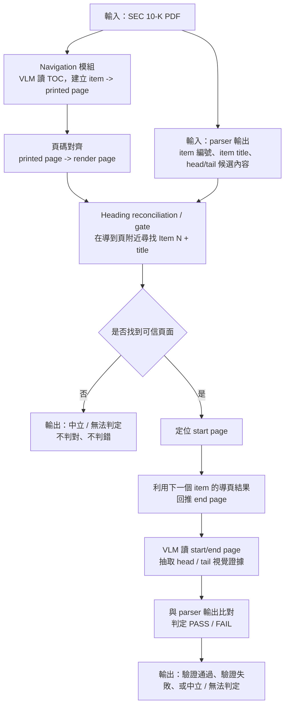

# SEC 10-K 視覺驗證器報告（Nav + E2E）

> 核心程式：[toc_nav/toc_extract.py](E:/SEC-10-K-Structured-Extraction/feedback/external_reference_validation/toc_nav/toc_extract.py)、[toc_nav/coverage.py](E:/SEC-10-K-Structured-Extraction/feedback/external_reference_validation/toc_nav/coverage.py)、[e2e/run.py](E:/SEC-10-K-Structured-Extraction/feedback/external_reference_validation/e2e/run.py)、[e2e/inject.py](E:/SEC-10-K-Structured-Extraction/feedback/external_reference_validation/e2e/inject.py)
> 對照資料：[toc_nav/report.md](E:/SEC-10-K-Structured-Extraction/feedback/external_reference_validation/toc_nav/report.md)、[e2e/report.md](E:/SEC-10-K-Structured-Extraction/feedback/external_reference_validation/e2e/report.md)

## 結論

本報告提出一套以 VLM 為核心的 SEC 10-K 視覺驗證器，將 parser 驗證拆成兩個可獨立量測的階段：

1. `nav`：先用獨立於 parser 內容的訊號，自動導出 `item -> render page`
2. `e2e`：再在導到的頁面上做 VLM 邊界檢查，驗證 parser 的 head / tail 是否正確，並量測對錯誤邊界的偵測能力

這套流程不是只提出方法，而是每個階段都用實驗數據驗證：

- `nav` 階段：在 5 份 10-K benchmark 上，頁面導航達到 `56/62 (90.3%)` exact，`60/62 (96.8%)` 落在 `±1`
- `e2e precision` 階段：以 `nav` 導到的頁、只在 gate 放行 item 上評估，`gemini-3-flash-preview` 可達 `head 59/60 (98.3%)`、`tail 38/44 (86.4%)`
- `e2e detection` 階段：在相同 e2e 條件下，`gemini-3-flash-preview` 對 4 類 parser 邊界錯誤的偵測率維持在 `83.1%–94.7%`

因此，這套 SEC 10-K 視覺驗證器不再依賴「先拿到正確 dataset page」這個樂觀前提，而是能在更接近實際部署的條件下，先自動定位頁面，再對 parser 結果做高信心外部複查。換句話說，本報告驗證的不只是某個 VLM 單點能力，而是一條從頁面導航到邊界檢查都可量化、可重現、可部署的完整驗證流程。

## 1. 問題定義

若頁面本身來自 dataset page，或仍從 parser 內容反推，整條驗證鏈就仍有一個未關閉的假設：

- 若 parser 已截斷，頁碼也可能跟著截斷一起跑偏
- 這會使得「驗證器看起來抓不到錯」其實只是因為它根本被導到了錯頁

因此，本報告真正要回答的不是「VLM 能不能讀頁面」，而是：

- 能不能先用獨立訊號自動導頁
- 導頁後，VLM 能不能在 clean case 上不誤殺
- 若 parser 邊界出錯，這條端到端鏈能不能實際抓到

也就是說，本報告驗證的是一套完整的 SEC 10-K 視覺驗證器是否成立。

## 2. 方法總覽

整體流程如下。這裡描述的是**實際部署場景**：一份 10-K 與 parser 輸出進來後，SEC 10-K 視覺驗證器如何運作；`e2e precision` 與 `e2e detection` 則是後面用來評估這條流程效果的實驗。



也就是先用獨立導航決定「該看哪一頁」，再用頁面上的視覺證據去檢查 parser 給出的 item 邊界是否可信。若流程中無法找到可信頁面，驗證器保持中立，只回報「無法判定」，不直接將 parser 結果判為對或錯。

這裡的分工非常明確：

- `nav` 負責回答「這個 item 應該看哪一頁」
- `e2e.run` 負責回答「正確 parser 會不會被誤殺」
- `e2e.inject` 負責回答「錯誤 parser 會不會被抓到」

## 3. 模型選型

模型選型分成兩塊：`nav model` 與 `detect model`。

### 3.1 Navigation model

`nav model` 固定選用 `google/gemini-3-flash-preview`。

理由不是單純因為某個單點 benchmark 成績最好，而是因為 navigation task 本身更難，實際包含了三種不同能力：

- 讀 TOC，抽出 `item -> printed page`
- 利用頁尾印刷頁碼把 `printed page -> render page`
- 在導到的頁附近做 heading reconciliation，避免撞到 TOC 頁與低頁碼干擾

這段若不穩，後面所有 e2e 結果都會被污染。因此 navigation 優先目標是覆蓋率與穩定性，而不是便宜或純 OCR 速度。綜合先前 benchmark、TOC 成功率與端到端表現，`gemini-3-flash-preview` 是目前最適合固定擔任 `nav model` 的選項。

### 3.2 Detection model

`detect model` 則採候選模型 sweep，比較哪個 VLM 在 e2e 條件下最適合做 Stage 2 / Stage 3。

本次納入的 13 個 non-free 候選模型如下：

- `google/gemini-3-flash-preview`
- `google/gemini-3.1-flash-lite`
- `google/gemini-2.5-pro`
- `google/gemini-2.5-flash`
- `google/gemma-4-31b-it`
- `google/gemma-4-26b-a4b-it`
- `qwen/qwen3.6-plus`
- `qwen/qwen3.6-27b`
- `qwen/qwen3.5-27b`
- `qwen/qwen3.5-122b-a10b`
- `qwen/qwen3.5-35b-a3b`
- `qwen/qwen3.5-9b`
- `moonshotai/kimi-k2.6`

比較口徑分成兩個：

- `e2e.run`：看 precision / false positive 控制
- `e2e.inject`：看 detection / recall

## 4. Stage 1: Navigation 結果

Navigation 先回答：在完全不依賴 parser 內容的前提下，能否自動導到正確頁。

### 4.1 方法

`toc_nav` 的流程是：

1. 用 VLM 掃前幾頁，判斷哪一頁是 TOC
2. 從 TOC 抽出 `item -> printed page`
3. 從 PDF 頁尾抓連續印刷頁碼，擬合 `printed page -> render page`
4. 以該頁為中心，在 `±1` 內搜尋 `Item N + title`，做 heading reconciliation
5. 若找不到可信標題則誠實棄驗，不硬猜

### 4.2 結果

| filing | TOC 抽取 | exact | within ±1 |
|---|---:|---:|---:|
| `GDC_2023` | 23 items | `15/16 (93.8%)` | `16/16 (100.0%)` |
| `NFLX_2025` | 23 items | `9/11 (81.8%)` | `11/11 (100.0%)` |
| `RELL_2025` | 23 items | `9/11 (81.8%)` | `10/11 (90.9%)` |
| `TSLA_2023` | 23 items | `11/12 (91.7%)` | `11/12 (91.7%)` |
| `WMT_2026` | 23 items | `12/12 (100.0%)` | `12/12 (100.0%)` |
| **合計** | **5/5 TOC 成功** | **56/62 (90%)** | **60/62 (97%)** |

這表示：

- TOC 抽取在 5 份 filing 上全部成功
- 單靠獨立導航就能在 `90%` 的 item 上精準命中頁面
- 若允許 `±1`，則 `97%` 的 item 可落在可修正範圍內

因此 `nav` 已足夠作為 downstream e2e verifier 的入口。

## 5. Stage 2: E2E Precision

### 5.1 評估定義

`e2e.run` 的目標是測 clean precision，也就是：

- 先用 `nav` 導頁
- 經過 `gate`
- 再在 clean 資料上做 head / tail 驗證

若 clean item 被判成 fail，就算誤殺。

### 5.2 基線結果：`gemini-3-flash-preview`

固定：

- `nav-model = google/gemini-3-flash-preview`
- `detect-model = google/gemini-3-flash-preview`

在 5 份 filing 上的 e2e precision 如下：

| filing | gate | head | tail |
|---|---:|---:|---:|
| `GDC_2023` | `16/16 (100.0%)` | `16/16 (100.0%)` | `9/10 (90.0%)` |
| `NFLX_2025` | `11/11 (100.0%)` | `11/11 (100.0%)` | `9/10 (90.0%)` |
| `RELL_2025` | `10/11 (90.9%)` | `9/10 (90.0%)` | `5/6 (83.3%)` |
| `TSLA_2023` | `11/12 (91.7%)` | `11/11 (100.0%)` | `8/10 (80.0%)` |
| `WMT_2026` | `12/12 (100.0%)` | `12/12 (100.0%)` | `7/8 (87.5%)` |
| **合計** | **60/62 (96.8%)** | **59/60 (98.3%)** | **38/44 (86.4%)** |

這裡的解讀是：

- `gate 60/62`：有 2 個 item 被誠實棄驗，而不是硬導到錯頁
- `head 59/60`：在 gated clean item 中，head 幾乎完全不誤殺
- `tail 38/44`：tail 明顯比 head 難，但仍保持可用的 precision

### 5.3 13 模型 sweep

固定 `nav-model = google/gemini-3-flash-preview`，對 13 個 detect model 跑 `e2e.run --batch 4`。下表採 **gated clean item** 口徑，因此分母固定為：

- head: `60`
- tail: `44`

| rank | detect model | head | tail |
|---|---|---:|---:|
| 1 | `google/gemini-3-flash-preview` | `59/60 (98.3%)` | `38/44 (86.4%)` |
| 2 | `google/gemini-3.1-flash-lite` | `60/60 (100.0%)` | `36/44 (81.8%)` |
| 2 | `google/gemini-2.5-pro` | `58/60 (96.7%)` | `36/44 (81.8%)` |
| 2 | `qwen/qwen3.6-plus` | `60/60 (100.0%)` | `34/44 (77.3%)` |
| 2 | `moonshotai/kimi-k2.6` | `57/60 (95.0%)` | `35/44 (79.5%)` |
| 6 | `google/gemini-2.5-flash` | `58/60 (96.7%)` | `34/44 (77.3%)` |
| 6 | `qwen/qwen3.6-27b` | `60/60 (100.0%)` | `33/44 (75.0%)` |
| 6 | `qwen/qwen3.5-27b` | `60/60 (100.0%)` | `33/44 (75.0%)` |
| 9 | `qwen/qwen3.5-35b-a3b` | `59/60 (98.3%)` | `32/44 (72.7%)` |
| 9 | `qwen/qwen3.5-9b` | `60/60 (100.0%)` | `32/44 (72.7%)` |
| 11 | `google/gemma-4-31b-it` | `56/60 (93.3%)` | `31/44 (70.5%)` |
| 12 | `qwen/qwen3.5-122b-a10b` | `60/60 (100.0%)` | `30/44 (68.2%)` |
| 13 | `google/gemma-4-26b-a4b-it` | `49/60 (81.7%)` | `20/44 (45.5%)` |

從 precision 角度看：

- `gemini-3-flash-preview` 仍是最穩的 tail baseline
- `gemini-3.1-flash-lite` 與 `gemini-2.5-pro` 也相當強
- Qwen 族群普遍 head 很穩，但 tail 仍略弱於 Gemini 系列

## 6. Stage 3: E2E Detection

### 6.1 評估定義

`e2e.inject` 的目標是測偵測率，也就是：

- 仍然先走 `nav + gate + clean prediction`
- 再對 GT 側注入邊界錯誤
- 看 clean 原本 PASS 的 item，注入後會不會被打成 FAIL

本次評估 4 類 operator：

- `truncate_head`
- `overrun_head`
- `truncate_tail`
- `overrun_tail`

並對每個 operator 測兩種強度：

- `50 lines`
- `50%`

### 6.2 基線結果：`gemini-3-flash-preview`

| operator | 50 lines | 50% |
|---|---:|---:|
| `truncate_head` | `53/59 (89.8%)` | `49/59 (83.1%)` |
| `overrun_head` | `55/59 (93.2%)` | `55/59 (93.2%)` |
| `truncate_tail` | `33/38 (86.8%)` | `36/38 (94.7%)` |
| `overrun_tail` | `36/38 (94.7%)` | `33/38 (86.8%)` |

換成百分比約為：

- `truncate_head`: `89.8% / 83.1%`
- `overrun_head`: `93.2% / 93.2%`
- `truncate_tail`: `86.8% / 94.7%`
- `overrun_tail`: `94.7% / 86.8%`

這代表：

- head 錯誤的偵測率非常穩
- tail 雖然仍較難，但在端到端條件下仍能維持 `86%–95%` 的區間
- 更重要的是，這些數字是在 **獨立導航頁** 上量到的，不再依賴 dataset page

### 6.3 13 模型 sweep

固定 `nav-model = google/gemini-3-flash-preview`，對 13 個 detect model 跑 `e2e.inject --batch 4`。

這張表的分母不是固定常數，因為只統計：

- `gate` 放行
- clean baseline `>= TH`

因此不同 detect model 的分母差異，反映的是該模型在 e2e clean 條件下實際可評估的樣本數，而不再只是 cache 是否完整。

| detect model | truncate_head | overrun_head | truncate_tail | overrun_tail |
|---|---|---|---|---|
| `google/gemini-3-flash-preview` | `53/59 (89.8%)` / `49/59 (83.1%)` | `55/59 (93.2%)` / `55/59 (93.2%)` | `33/38 (86.8%)` / `36/38 (94.7%)` | `36/38 (94.7%)` / `33/38 (86.8%)` |
| `google/gemini-3.1-flash-lite` | `54/60 (90.0%)` / `50/60 (83.3%)` | `56/60 (93.3%)` / `56/60 (93.3%)` | `31/36 (86.1%)` / `35/36 (97.2%)` | `34/36 (94.4%)` / `32/36 (88.9%)` |
| `google/gemini-2.5-pro` | `52/58 (89.7%)` / `48/58 (82.8%)` | `54/58 (93.1%)` / `54/58 (93.1%)` | `29/36 (80.6%)` / `34/36 (94.4%)` | `35/36 (97.2%)` / `30/36 (83.3%)` |
| `google/gemini-2.5-flash` | `51/58 (87.9%)` / `48/58 (82.8%)` | `54/58 (93.1%)` / `54/58 (93.1%)` | `29/34 (85.3%)` / `33/34 (97.1%)` | `32/34 (94.1%)` / `27/34 (79.4%)` |
| `google/gemma-4-31b-it` | `50/56 (89.3%)` / `46/56 (82.1%)` | `53/56 (94.6%)` / `53/56 (94.6%)` | `28/31 (90.3%)` / `30/31 (96.8%)` | `29/31 (93.5%)` / `27/31 (87.1%)` |
| `google/gemma-4-26b-a4b-it` | `43/49 (87.8%)` / `40/49 (81.6%)` | `47/49 (95.9%)` / `47/49 (95.9%)` | `20/20 (100.0%)` / `20/20 (100.0%)` | `17/20 (85.0%)` / `15/20 (75.0%)` |
| `qwen/qwen3.6-plus` | `54/60 (90.0%)` / `50/60 (83.3%)` | `56/60 (93.3%)` / `56/60 (93.3%)` | `26/34 (76.5%)` / `33/34 (97.1%)` | `32/34 (94.1%)` / `27/34 (79.4%)` |
| `qwen/qwen3.6-27b` | `54/60 (90.0%)` / `50/60 (83.3%)` | `56/60 (93.3%)` / `56/60 (93.3%)` | `27/33 (81.8%)` / `32/33 (97.0%)` | `30/33 (90.9%)` / `27/33 (81.8%)` |
| `qwen/qwen3.5-27b` | `53/60 (88.3%)` / `51/60 (85.0%)` | `56/60 (93.3%)` / `56/60 (93.3%)` | `30/33 (90.9%)` / `33/33 (100.0%)` | `31/33 (93.9%)` / `27/33 (81.8%)` |
| `qwen/qwen3.5-122b-a10b` | `54/60 (90.0%)` / `51/60 (85.0%)` | `56/60 (93.3%)` / `56/60 (93.3%)` | `25/30 (83.3%)` / `29/30 (96.7%)` | `28/30 (93.3%)` / `25/30 (83.3%)` |
| `qwen/qwen3.5-35b-a3b` | `53/59 (89.8%)` / `52/59 (88.1%)` | `54/59 (91.5%)` / `55/59 (93.2%)` | `27/32 (84.4%)` / `31/32 (96.9%)` | `29/32 (90.6%)` / `25/32 (78.1%)` |
| `qwen/qwen3.5-9b` | `53/60 (88.3%)` / `52/60 (86.7%)` | `55/60 (91.7%)` / `56/60 (93.3%)` | `26/32 (81.2%)` / `30/32 (93.8%)` | `30/32 (93.8%)` / `28/32 (87.5%)` |
| `moonshotai/kimi-k2.6` | `47/57 (82.5%)` / `42/57 (73.7%)` | `53/57 (93.0%)` / `53/57 (93.0%)` | `30/35 (85.7%)` / `34/35 (97.1%)` | `33/35 (94.3%)` / `28/35 (80.0%)` |

從 detection 角度看：

- `gemini-3-flash-preview` 維持最完整的可評估分母，整體最平衡
- `gemini-3.1-flash-lite` 與 `gemini-2.5-pro` 的 e2e detection 也相當強
- `qwen3.5-27b` 在 tail truncate 上不錯，但整體分母與穩定度仍略輸 Gemini

## 7. 綜合判斷與部署建議

綜合 `nav`、`e2e precision`、`e2e detection` 三塊，本報告建議的 SEC 10-K 視覺驗證器方案如下：

- `nav model`: `google/gemini-3-flash-preview`
- `detect model`: 首選仍為 `google/gemini-3-flash-preview`

理由是：

1. 它在 navigation 所需的 TOC / printed-page / heading reconciliation 任務上最穩
2. 它在 e2e precision 上給出目前最佳 tail 基線：`38/44`
3. 它在 e2e detection 上同時具備高偵測率與最大可評估分母

如果要保留備援 detect model，第二梯隊可考慮：

- `google/gemini-3.1-flash-lite`
- `google/gemini-2.5-pro`
- `qwen/qwen3.6-plus`

但目前若要作為正式主基線，`gemini-3-flash-preview` 仍是最平衡的選擇。

## 8. 限制與誠實邊界

1. `nav` 並非 100% 覆蓋，尤其低頁碼 item 1 類型仍較脆弱，因此 `gate` 會誠實棄驗
2. `tail` 分母天然小於 head，因為只在可評估的 prose / gated / clean-pass 子集上統計
3. 不同 detect model 在 `inject` 的分母不同，這不是 bug，而是 clean-pass 子集不同
4. benchmark 目前仍為 5 份 filing，尚不足以宣稱已完全涵蓋所有 10-K 版型
5. 本報告中的「命中頁面」定義，仍是對照 dataset page range，而非人工逐頁重新標註的 render-page gold set

## 9. 重現方式

### Navigation

```bash
python -m feedback.external_reference_validation.toc_nav.toc_extract --label GDC_2023
python -m feedback.external_reference_validation.toc_nav.coverage --model google/gemini-3-flash-preview
```

### E2E precision

```bash
python -m feedback.external_reference_validation.e2e.run --label GDC_2023 --nav-model google/gemini-3-flash-preview --detect-model google/gemini-3-flash-preview --batch 4
```

### E2E detection

```bash
python -m feedback.external_reference_validation.e2e.inject --nav-model google/gemini-3-flash-preview --detect-model google/gemini-3-flash-preview --batch 4
```

### 本次 sweep log

- `e2e.run` log： [e2e_run_logs](E:/SEC-10-K-Structured-Extraction/feedback/external_reference_validation/report/e2e_run_logs)
- `e2e.inject` log： [e2e_inject_logs_after_run](E:/SEC-10-K-Structured-Extraction/feedback/external_reference_validation/report/e2e_inject_logs_after_run)
